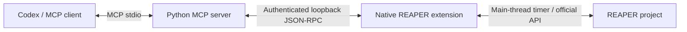

# REAPER MCP

Control a local REAPER project from Codex or another MCP client through a native
C++ extension and the official Python MCP SDK. Windows 10/11 x64 is the first target.
No ReaScript installation, web server, audio upload, or Python installation is
required when using the standalone Windows installer.

**Status: 0.1.0-alpha.1.** Automated Python, native and packaging tests are provided.
Real REAPER + Codex + third-party plugin acceptance must still be verified on a
Windows workstation. Do not treat this alpha as a production-certified DAW tool.

[Releases](https://github.com/juliaexterkoetter/reaper-mcp/releases) ·
[CI](https://github.com/juliaexterkoetter/reaper-mcp/actions) ·
[Tool behavior and limitations](docs/MCP_TOOLS.md) · [Troubleshooting](docs/TROUBLESHOOTING.md)

## Install

1. Install **REAPER 7.80+ x64** and the **Codex CLI**. Open REAPER once, then close it.
2. Download the Windows x64 `setup.exe` from Releases and run it as your normal user.
3. Leave REAPER paths blank for automatic detection. For a portable copy, select
   its folder; select the resource directory too if it is customized.
4. Open REAPER and a saved test `.rpp` project. Open a new terminal and run:

   ```powershell
   reaper-mcp doctor
   ```

5. Restart Codex and ask: **“Liste todas as tracks do projeto aberto.”**

Expected diagnosis: `[OK] installation`, `[OK] codex`, `[OK] native-bridge`, exit 0.
The answer should contain the project's actual track names and GUIDs. If diagnosis
fails, see [Troubleshooting](docs/TROUBLESHOOTING.md); do not troubleshoot sockets
or copy DLLs manually. A Start menu diagnostic shortcut is also installed.

The installer bundles the Python runtime, installs the native extension, creates
a private local token, and calls the official `codex mcp add` command. The alpha
installer is unsigned. No PyPI publication is currently claimed. For standalone
ZIP, source builds, security policy and other clients, see [Installation](docs/INSTALLATION.md).

## Example requests

- “Mostre o volume, pan, mute e solo de todas as tracks.”
- “Reduza a track Voice em 3 dB e confirme o valor resultante.”
- “Liste os plugins disponíveis antes de adicionar um efeito.”
- “Desfaça a última alteração.” (Undo requires approval and can include manual edits.)

Use the supplied test project or a disposable copy for initial acceptance.

## Features

| Area | Implemented in this alpha | Boundaries |
|---|---|---|
| Projects | Inspect tabs/current project, save, native Undo/Redo | Save an existing path; Save As planned |
| Tracks | List/get/create/delete/rename; dB, pan %, mute, solo | Normal tracks; use GUIDs for duplicate names |
| Items and takes | List/get/split/move/trim/delete, gain/fades; inspect takes | Locked items rejected; source files never deleted |
| Transport | Play/stop/pause, state and edit cursor | Read-only policy blocks changes |
| FX | Discover installed plugins; add/remove/bypass; normalized parameters | Top-level normal track FX; plugin-dependent behavior |
| Markers/regions | List/create/update/delete by persistent GUID | Requires modern REAPER API baseline |
| Automation | Read envelopes; volume/pan base-point creation/update; point deletion | Existing envelopes only; no automation-item pools |
| Render | Settings and isolated queued master-mix output | Experimental; nonempty output is not audio validation |
| Environment | Versions, sample rates, resource paths, FX chains/templates discovery | Discovery only; preset application planned |
| Administration | Install/uninstall, doctor/status/version/logs, official Codex registration | `update` points to releases; no unattended updater |

Semantic mixing, LUFS/true-peak analysis, video, Linux/macOS/ARM runtime support,
master/input/take FX and multi-instance selection are **planned**.
See [Roadmap](docs/ROADMAP.md) for the acceptance gate before a stable release.

## How it works



The native bridge binds only `127.0.0.1` on an ephemeral port. Requests require a
per-installation secret stored with private Windows ACLs. There is no arbitrary
shell, ReaScript, generic REAPER action, or remotely exposed HTTP endpoint. All
REAPER API access runs on its main thread. Requests are bounded and mutations are
never automatically retried after a timeout.

Default policy is `confirm-destructive`. Read-only and full-control are available.
`confirm: true` is the client's assertion that approval was obtained; it is not
proof of human consent. Use client approval controls and `read-only` when needed.
Undo covers supported project edits; saving, transport and rendering are not
transactional. [Security](SECURITY.md) explains the trust boundary.

## Development and testing

```bash
python -m venv .venv
# Activate .venv using your shell, then:
python -m pip install -c packaging/constraints.txt -e ".[dev]"
ruff check src tests scripts
ruff format --check src tests scripts
mypy src
pytest -q
python -m build
```

Native build requires Windows x64, CMake and MSVC:

```powershell
cmake -S reaper-extension -B build/extension -A x64
cmake --build build/extension --config Release
ctest --test-dir build/extension -C Release --output-on-failure
```

Mocks and synthetic installation fixtures are confined to tests. The CI builds
on Linux/Windows with Python 3.11/3.14, tests native C++, then exercises the frozen
executable, official Codex CLI registration and Setup installation/removal on
Windows. [Validation scope](docs/VALIDATION.md) and [acceptance testing](docs/ACCEPTANCE.md)
distinguish these checks from a real REAPER session.

## Project documentation

[Architecture](docs/ARCHITECTURE.md), [protocol](docs/PROTOCOL.md),
[ADRs](docs/ADR), [contributing](CONTRIBUTING.md), [changelog](CHANGELOG.md),
[agent instructions](AGENTS.md), [code of conduct](CODE_OF_CONDUCT.md).

MIT license for this project. Bundled dependencies retain their own licenses.
REAPER is a separate product and is not redistributed. This is an independent
community project, not an official Cockos or OpenAI product.
