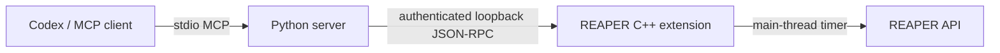

# Architecture

Status: implementation in progress; Windows x64 is the initial target.

No AI logic lives in the extension. No project is uploaded by this software.
Clients may send tool results to their model provider under their own policies.
The native adapter owns pointer resolution, validation, Undo and capabilities.
Python owns typed tools, client policy, installation and diagnostics.
The bridge binds an ephemeral IPv4 loopback port, publishes discovery in the
REAPER resource directory and requires a random per-installation token.
A nonblocking timer services bounded connections on the REAPER main thread;
there are no worker-thread REAPER API calls. Long native actions can still block
REAPER; render requires separate treatment and must not pretend to be async.

## Official sources consulted (2026-09-17)

- https://developers.openai.com/codex/mcp — stdio and official CLI registration.
- https://github.com/modelcontextprotocol/python-sdk — official SDK, version boundaries.
- https://py.sdk.modelcontextprotocol.io/ — current API documentation.
- https://modelcontextprotocol.io/specification/2025-11-25/basic/transports
- https://www.reaper.fm/sdk/plugin/plugin.php — native extension entry point.
- https://www.reaper.fm/sdk/reascript/reascripthelp.html — API signatures and semantics.
- https://github.com/justinfrankel/reaper-sdk — SDK headers and license.
- https://cmake.org/cmake/help/latest/generator/Visual%20Studio%2017%202022.html
- https://learn.microsoft.com/en-us/windows/win32/ipc/named-pipe-security-and-access-rights

Versions resolved by actual builds are recorded separately; documentation alone
is not evidence that a package or a native binary was tested.

## Native lifecycle and bounds

The extension loads only the SDK functions explicitly requested by api.hpp and
rejects incompatible hosts. Winsock IO never blocks: each timer accepts at most
one peer and transfers at most 64 KiB per peer, with at most eight peers and a
2-second lifetime. Frames are bounded to 1 MiB. The timer owns socket state and
all future REAPER operations; no cross-thread pointer lifetime exists.
Unloading unregisters the callback before closing peers/listener and deleting
owned discovery. MCP termination does not affect REAPER. An existing discovery
file prevents a second instance from overwriting the endpoint. Crash leftovers
need a diagnostic repair after confirming that the original process is gone.

Blocking REAPER API operations are not made asynchronous by this architecture.
Native dialogs and long renders need explicit UX treatment. Budgeting network
IO does not bound the duration of an individual host API call.
